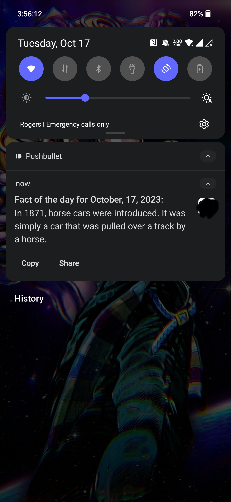

# Fact of The Day Bot

This Python script retrieves a random fact and sends it as a notification to my android device every 8am EST.

## Setup

### Tools used:
<a href="https://api-ninjas.com/api/facts" target="_blank">Notifications API: PushBullet</a>  
<a href="https://www.pushbullet.com/" target="_blank">Facts API: API Ninjas</a>  
<a href="https://www.pythonanywhere.com/" target="_blank">Hosting: PythonAnywhere</a>  
*All will require creating an account*

### API Tokens

Before running the script, make sure you have obtained API tokens for both Pushbullet and the API Ninjas. For security, I saved these tokens in separate text files named `bullet_api_token.txt` and `fact_api_token.txt` respectively.

API Tokens:

-Pushbullet API Token:

This token allows the script to interact with the Pushbullet service. It's necessary for sending notifications on the app pushbullet.

-API Ninjas token:
This token is used to access the API that provides random facts.

### Dependencies

Install the required Python libraries using the following command (If you get an error during installation, try installing the package as admin):

`pip3.8 install pushbullet requests`

### Upload Script
Upload your Python script along with your tokens to your PythonAnywhere account.

Go to the "Tasks" tab on PythonAnywhere.

Add a new scheduled task.

Specify the command to run your script, for example:

python3.8 /path/to/your/script/daily_fact_notifier.py and set the desired schedule for your script to run daily.

### Sample

